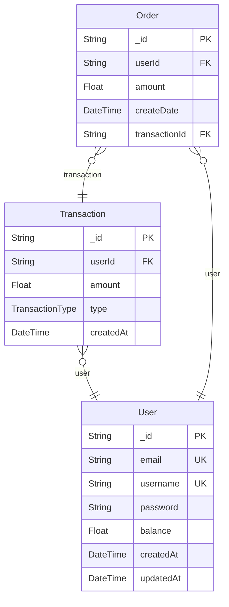

# Entity-Relationship Diagram
> Generated by [`prisma-markdown`](https://github.com/samchon/prisma-markdown)

- [default](#default)

## default

### `User`

**Properties**
  - `_id`: 
  - `email`: 
  - `username`: 
  - `password`: 
  - `balance`: 
  - `createdAt`: 
  - `updatedAt`: 

### `Transaction`

**Properties**
  - `_id`: 
  - `userId`: 
  - `amount`: 
  - `type`: 
  - `createdAt`: 

### `Order`

**Properties**
  - `_id`: 
  - `userId`: 
  - `amount`: 
  - `createDate`: 
  - `transactionId`: 